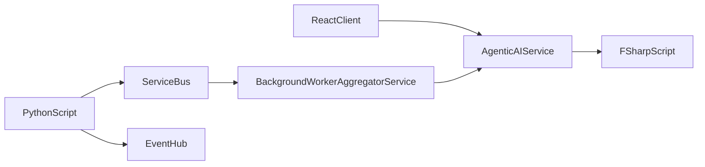

# RaspberryAzure


## What the Project Does
RaspberryAzure is a project designed to seamlessly integrate Raspberry Pi devices with Microsoft Azure services. It provides tools and scripts to enable IoT solutions, data collection, and cloud-based analytics using Azure's robust ecosystem.

## Why the Project is Useful
- **IoT Integration**: Simplifies connecting Raspberry Pi devices to Azure IoT Hub.
- **Data Analytics**: Enables real-time data collection and processing in the cloud.
- **Scalability**: Leverages Azure's scalable infrastructure for large-scale IoT deployments.
- **Ease of Use**: Provides pre-configured scripts and examples to get started quickly.

## Diagrams



## How Users Can Get Started

### Prerequisites
- A Raspberry Pi device with Raspbian OS installed.
- An active Microsoft Azure account.
- Python 3.7 or higher installed on the Raspberry Pi.

### Installation
1. Clone the repository:
   ```bash
   git clone https://github.com/regig4/RaspiFlow.git
   cd RaspberryAzure
   ```
2. Install dependencies:
   ```bash
   pip install -r requirements.txt
   ```
3. Configure Azure credentials:
   - Follow the instructions in `docs/SETUP.md` to set up your Azure IoT Hub and retrieve connection strings.
   - Update the `config.json` file with your Azure credentials.

### Usage
Run the AppHost project which spins up local environment

## Where Users Can Get Help
- Issues: [GitHub Issues](https://github.com/regig4/RaspiFlow/issues)
- Community: Join the discussion on [GitHub Discussions](https://github.com/regig4/RaspiFlow/discussions)

## Who Maintains and Contributes
- **Maintainer**: regig4
- **Contributors**: See the list of [contributors](https://github.com/regig4/RaspiFlow/graphs/contributors) who participated in this project.

### Contribution Guidelines
We welcome contributions! Please see `docs/CONTRIBUTING.md` for details on how to get involved.

---

This project is licensed under the MIT License. See the `LICENSE` file for details.
